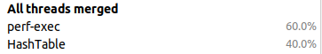

# Hash table optimization

## Introduction
This is a students project from [Ded's](http://ded32.net.ru) course of 2nd semester in MIPT.  

## Goals
The main tasks of the project:

- [x] Create a Hash table class
- [x] Write various hash functions to check their effectivity.
- [x] Use some different methods to optimize speed of work of hash table. 
- [x] Show the results to interested people.
- [x] Be impressive
- [ ] ~~Find a gf~~

## Dependencies

* My [double linked list](https://github.com/Mikipaw/MIPT-1sem/tree/master/MIPT_1sem/List) (upgraded) from 1st semester in MIPT
* The _simple_string_ class and some functions with it came from my [Onegin project](https://github.com/Mikipaw/MIPT-1sem/tree/master/MIPT_1sem/Onegin)
* 5 interesting hash functions were given by [Ded](ded32.ru)
* [Callgrind](https://valgrind.org/docs/manual/cl-manual.html) profiler
* [CLion perf](https://www.jetbrains.com/help/clion/cpu-profiler.html) profiler

## Little ~~ending~~ theoretical information.

In computing, a hash table, also known as hash map, is a data structure that implements an associative array abstract data type, a structure that can map keys to values. A hash table uses a hash function to compute an index, also called a hash code, into an array of buckets or slots, from which the desired value can be found. During lookup, the key is hashed and the resulting hash indicates where the corresponding value is stored.

Ideally, the hash function will assign each key to a unique bucket, but most hash table designs employ an imperfect hash function, which might cause hash collisions where the hash function generates the same index for more than one key. Such collisions are typically accommodated in some way.

### Complexity

Let's see the complexity of standard C++ containers:

What can we say about hash table?

* Insert — O(1)
* Remove — O(1)
* Find — O(1)
* Memory — O(N)

But it really depends on hash-function. So this values are for good function with small number of collisions.
In bad cases we may get a O(N) complexity for any of method.

### Separate chaining

In separate chaining, the process involves building a linked list with key-value pair for each search array index. 
The collided items are chained together through a double linked list, which can be traversed to access the item with a unique search key. 
Collision resolution through chaining i.e. with a linked list is a common method of implementation.

In my program I used this method to solve the problem with collisions.

## Working process

### Creating a hash table class.

I created a hash table class in ~~Java~~ C++.

### Compilation parameters

All measurements made with -O2 optimization.

### Effectivity of hash functions.

The next task for me was making some experiments with different hash functions to understand the best one.
For me good hash function is a function with average number of collisions less than 1 per element.

I found a text file with more than 84000 words and used it for the measurements.
After getting some results, I have created a diagram where you can see the exponential dependence (it is the best way to see differences between hash functions I used).

Before the optimization I used function _my_hash_, but after some time I changed it to _crc_hash_ (more on that later).

### Choosing the profiler

After some experiments I decided to use the perf profiler. It is more comfortable (because located in CLion) and it calls functions by their names.

### Optimization № 1

Firstly I saw this results:

This is a relative usage of resources: 

And an absolute usage:

Here we can see that functions _my_hash_ (with _operator[]_) and _sscmp_ are so massive.
They should be more modest.

I think that upgrade of _operator[]_ is not possible, because there is nothing to upgrade.
The only thing I can do is use it not so often.

So I decided to optimize _sscmp_ function.
I changed it to previous version, where it returns not {-1, 0, 1}, but sub of the first different symbols in 2 comparative words.
After this we don't use division and getting the reminder.

Here we see, that sscmp has increased almost 3 times. 

So our program became faster on 2.6%.

### Optimization № 2

The next function in the queue — _Fill_new_elems_ in _double-linked-list_. After the optimization we don't call a _simple_string_ constructor for every iteration and
every empty element's pointer to string points to 1 string at all.

As a result we can see, that our program has increased on 10.3%:

The only minus of this optimization is that the empty string became less protected. Bit it is not necessary, because it needs for graphical dump only.

### Optimization № 3

The last optimization is hash function. I noticed that my function works so slow.
On the seminar we were talking about length of the strings and as a result we understood that most of
the words in English language have less than 32 letters. So I decided to use the constant size of every word equal to 32.
In the secret book I have found out some information about crc32 function from Intel. 
I checked the effectivity of this hash function and this function was better than mine in number of collisions and in speed.

## Conclusion

Finally, we may see that our program became really faster (~3 times).

